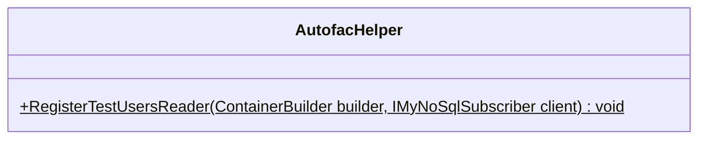
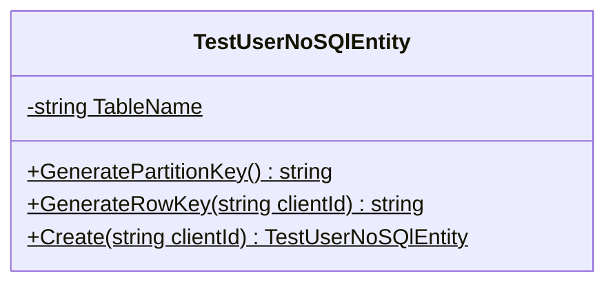

<!-- markdownlint-capture -->
<!-- markdownlint-disable -->

# Code Metrics

This file is dynamically maintained by a bot, *please do not* edit this by hand. It represents various [code metrics](https://aka.ms/dotnet/code-metrics), such as cyclomatic complexity, maintainability index, and so on.

## MyJetWallet.TestUsers :heavy_check_mark:

The *MyJetWallet.TestUsers.csproj* project file contains:

- 1 namespaces.
- 2 named types.
- 26 total lines of source code.
- Approximately 5 lines of executable code.
- The highest cyclomatic complexity is 1 :heavy_check_mark:.

  <strong id="myjetwallet-testusers">
    MyJetWallet.TestUsers :heavy_check_mark:
  </strong>

 

The `MyJetWallet.TestUsers` namespace contains 2 named types.

- 2 named types.
- 26 total lines of source code.
- Approximately 5 lines of executable code.
- The highest cyclomatic complexity is 1 :heavy_check_mark:.

  <strong id="autofachelper">
    AutofacHelper :heavy_check_mark:
  </strong>

 

- The `AutofacHelper` contains 1 members.
- 7 total lines of source code.
- Approximately 1 lines of executable code.
- The highest cyclomatic complexity is 1 :heavy_check_mark:.

| Member kind | Line number | Maintainability index | Cyclomatic complexity | Depth of inheritance | Class coupling | Lines of source / executable code |
| :-: | :-: | :-: | :-: | :-: | :-: | :-: |
| Method | <a href='https://github.com/MyJetWallet/MyJetWallet.TestUsers/blob/master/src/MyJetWallet.TestUsers/AutofacHelper.cs#L9' title='void AutofacHelper.RegisterTestUsersReader(ContainerBuilder builder, IMyNoSqlSubscriber client)'>9</a> | 94 | 1 :heavy_check_mark: | 0 | 4 | 4 / 1 |

<a href="#AutofacHelper-class-diagram">:link: to `AutofacHelper` class diagram</a>

<a href="#myjetwallet-testusers">:top: back to MyJetWallet.TestUsers</a>

  <strong id="testusernosqlentity">
    TestUserNoSQlEntity :heavy_check_mark:
  </strong>

 

- The `TestUserNoSQlEntity` contains 4 members.
- 15 total lines of source code.
- Approximately 4 lines of executable code.
- The highest cyclomatic complexity is 1 :heavy_check_mark:.

| Member kind | Line number | Maintainability index | Cyclomatic complexity | Depth of inheritance | Class coupling | Lines of source / executable code |
| :-: | :-: | :-: | :-: | :-: | :-: | :-: |
| Method | <a href='https://github.com/MyJetWallet/MyJetWallet.TestUsers/blob/master/src/MyJetWallet.TestUsers/TestUserNoSQlEntity.cs#L11' title='TestUserNoSQlEntity TestUserNoSQlEntity.Create(string clientId)'>11</a> | 92 | 1 :heavy_check_mark: | 0 | 1 | 8 / 1 |
| Method | <a href='https://github.com/MyJetWallet/MyJetWallet.TestUsers/blob/master/src/MyJetWallet.TestUsers/TestUserNoSQlEntity.cs#L8' title='string TestUserNoSQlEntity.GeneratePartitionKey()'>8</a> | 100 | 1 :heavy_check_mark: | 0 | 0 | 1 / 1 |
| Method | <a href='https://github.com/MyJetWallet/MyJetWallet.TestUsers/blob/master/src/MyJetWallet.TestUsers/TestUserNoSQlEntity.cs#L9' title='string TestUserNoSQlEntity.GenerateRowKey(string clientId)'>9</a> | 100 | 1 :heavy_check_mark: | 0 | 0 | 1 / 1 |
| Field | <a href='https://github.com/MyJetWallet/MyJetWallet.TestUsers/blob/master/src/MyJetWallet.TestUsers/TestUserNoSQlEntity.cs#L7' title='string TestUserNoSQlEntity.TableName'>7</a> | 93 | 0 :heavy_check_mark: | 0 | 0 | 1 / 1 |

<a href="#TestUserNoSQlEntity-class-diagram">:link: to `TestUserNoSQlEntity` class diagram</a>

<a href="#myjetwallet-testusers">:top: back to MyJetWallet.TestUsers</a>

<a href="#myjetwallet-testusers">:top: back to MyJetWallet.TestUsers</a>

## Metric definitions

  - **Maintainability index**: Measures ease of code maintenance. Higher values are better.
  - **Cyclomatic complexity**: Measures the number of branches. Lower values are better.
  - **Depth of inheritance**: Measures length of object inheritance hierarchy. Lower values are better.
  - **Class coupling**: Measures the number of classes that are referenced. Lower values are better.
  - **Lines of source code**: Exact number of lines of source code. Lower values are better.
  - **Lines of executable code**: Approximates the lines of executable code. Lower values are better.

## Mermaid class diagrams

##### `AutofacHelper` class diagram

##### `TestUserNoSQlEntity` class diagram

*This file is maintained by a bot.*

<!-- markdownlint-restore -->
